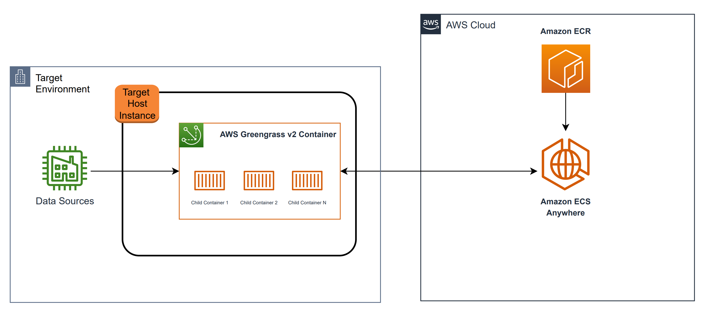

# AWS IoT GreenGrass v2 Docker in Docker
## Overview
AWS IoT GreenGrass v2 does not allow to run any Docker application container if GreenGrass itself is running inside a Docker container. E.g. if you want to run AWS IoT SiteWise Edge inside GGv2 container, AWS IoT SiteWise Edge requires docker container to run its components. This container image is built on the official AWS IoT GreenGrass version 2 docker image to run your containerized applications in it. Therefore, after you follow steps below, you can also leverage from [the official AWS IoT GreenGrass v2 guideline](https://github.com/aws-greengrass/aws-greengrass-docker) to use additional AWS IoT GreenGrass related operations. Before using in production please read the following [blog](https://jpetazzo.github.io/2015/09/03/do-not-use-docker-in-docker-for-ci/).

## Example Architecture Diagram for the Solution
You can use this solution as standalone or you can integrate it to a container orchestration tool like Amazon ECS Anywhere. For using it with container orchestration
tool, you can find an example target deployment architecture for Amazon ECS Anywhere below: 



## Build Image
`docker-compose -f docker/docker-compose.yml build`

## Update AWS Credential
For standalone usage, you can use AWS credential. But, if you have an environment that has an IAM role, it is important to use corresponding IAM roles with required permission for security best practices. 

`path_to_dir/greengrass-v2-credentials/credentials`

Example "credentials" file:

```
[default]
aws_access_key_id = <YourAWSAccessKey>
aws_secret_access_key = <YourSecretKey>
```

## AWS IoT GreenGrass v2 Provisioning
You can provide your environment file like below. 
 
### Provide Your Environment File for Provisioning
Create env file and copy your config accordingly. 

`nano env.cfg`
```
GGC_ROOT_PATH=/greengrass/v2
AWS_REGION=eu-west-1
PROVISION=true
THING_NAME=MyGreengrassCore
THING_GROUP_NAME=MyGreengrassCoreGroup
TES_ROLE_NAME=GreengrassV2TokenExchangeRole
TES_ROLE_ALIAS_NAME=GreengrassCoreTokenExchangeRoleAlias
COMPONENT_DEFAULT_USER=ggc_user:ggc_group
```
## Run AWS IoT GreenGrass v2 Docker in Docker Image
* **WARNING**: For running this image, you need to provide a "privileged" flag, therefore it is important to know whether your security threat model allows this action in your environment.

`docker run --privileged --rm --init -it --name aws-iot-gg -v path_to_cred/greengrass-v2-credentials:/root/.aws:ro --env-file env.cfg  -p 8883 x86_64/aws-iot-greengrass:2.5.3 `

## Open Shell in the Image
`docker exec -it CONTAINER_ID /bin/sh`

## Available Commands in Image
Docker is already installed in the container image, after you log in, you can use docker commands to manage application containers

## Security

See [CONTRIBUTING](CONTRIBUTING.md#security-issue-notifications) for more information.

## License

This library is licensed under the MIT-0 License. See the LICENSE file.

